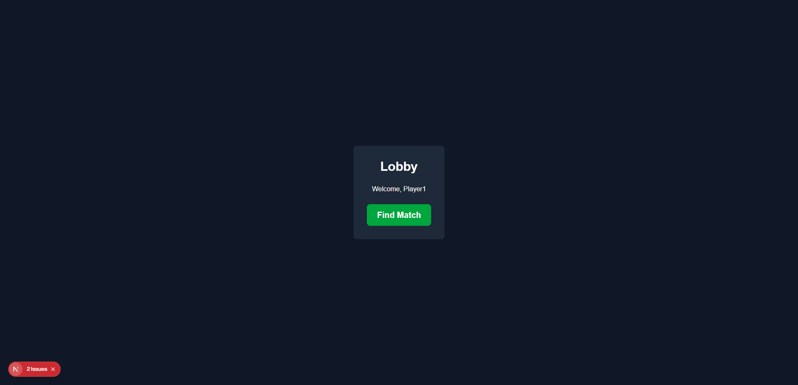
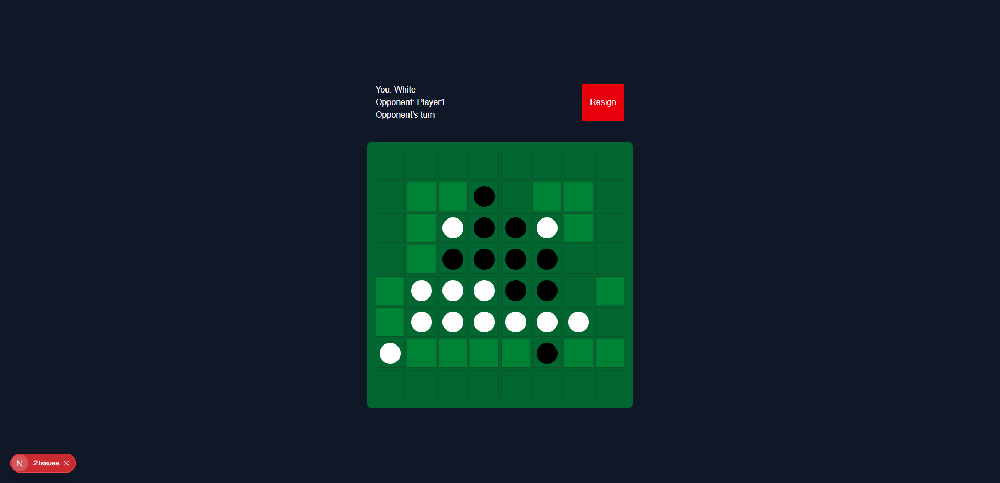
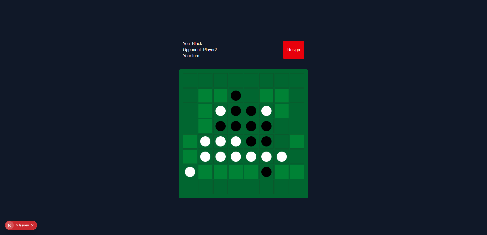
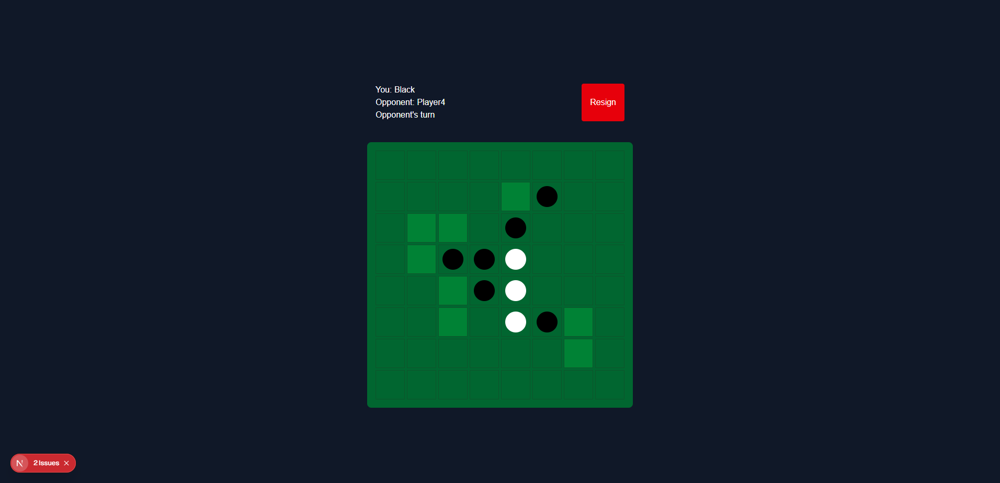
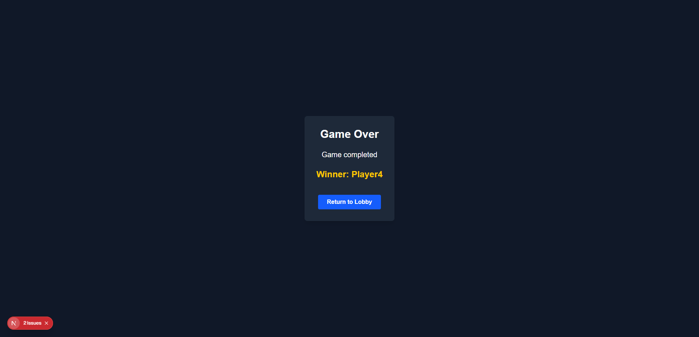

# Multiplayer Reversi

## Screenshots

### Lobby

### Playing

### Winner

## Features

- Sharing messages
  - ClientMessage and ServerMessage
  - Connect and Disconnect
  - SendMessage
- Finding matches
  - QueueEntry, which manages player info and ready flag
  - Supply matchmaking service with queues
- Managing sessions
  - Actor Based Session
  - Manage user status
  - operate WebSocket Streaming handler
